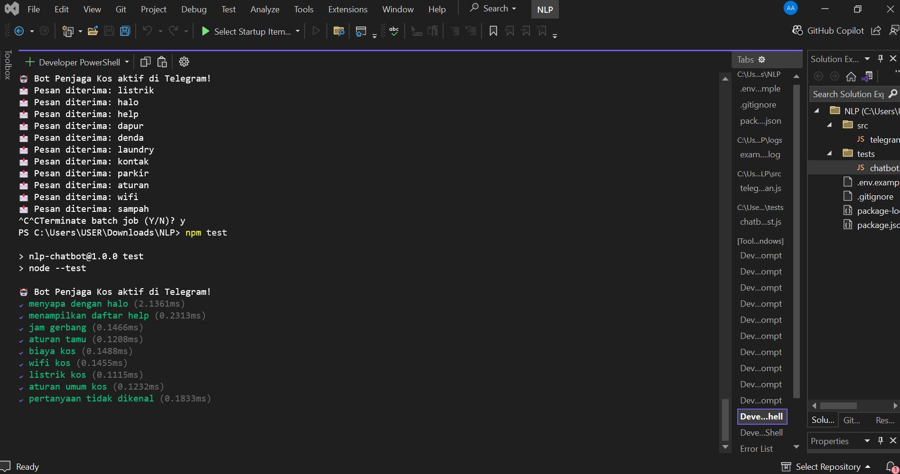
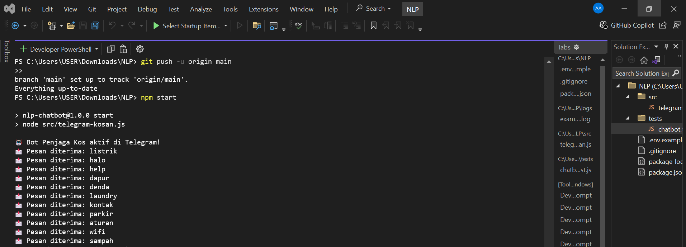
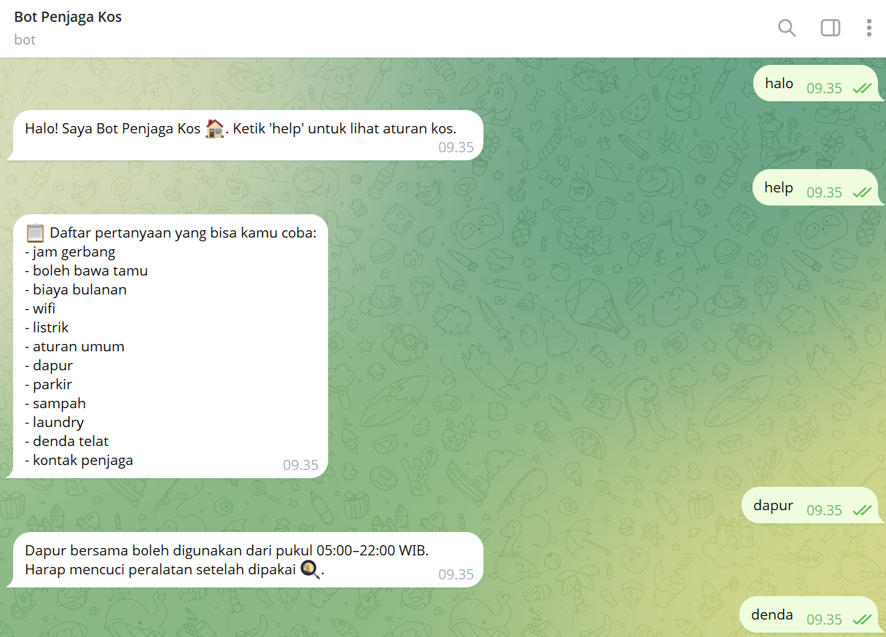
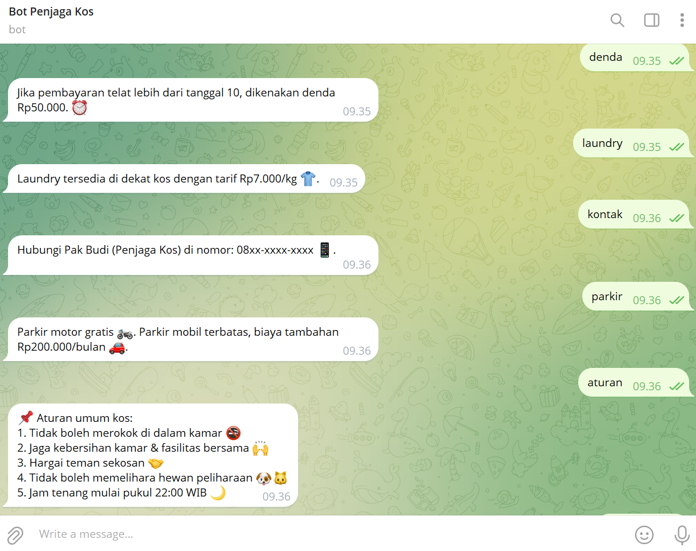
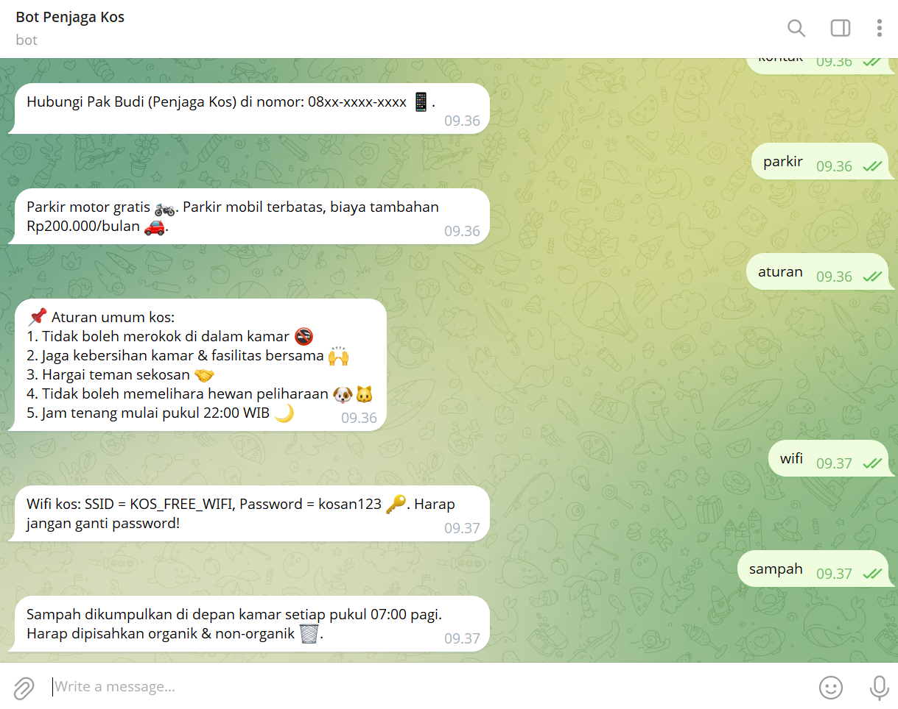

# 🏠 NLP Chatbot Kosan (Telegram)

hatbot sederhana berbasis **Node.js** untuk membantu penghuni kos dengan aturan, jadwal, dan informasi fasilitas.  
Bot ini terintegrasi dengan **Telegram Bot API**.   

---

## 📦 Setup

### 1. Clone Repository
```bash
git clone https://github.com/selvirasell/NLP-Chatbot-Regex.git
```

### 2. Install Dependencies
```bash
npm install
```

### 3. Konfigurasi Environment
Buat file `.env` di root proyek berdasarkan `.env.example`.  
`.env.example`
```env
TELEGRAM_BOT_TOKEN=your-telegram-bot-token-here
```

---

## ▶️ Cara Menjalankan

### CLI
```bash
npm start
```


### Telegram
1. Buat bot via **@BotFather** di Telegram.
2. Dapatkan API token, isi ke `.env`.
3. Jalankan bot:
   ```bash
   npm start
   ```
4. Buka Telegram → cari username bot → mulai chat.

---

## 🧪 Testing

### Jalankan test
```bash
npm test
```
### Hasil Test




## 📑 Contoh Log




## 📸 Demo
- Telegram Demo: 




---

## 👩‍💻 Kontributor
- **Nama**: Aisa Selvira Quraata A’yunni  
- **NIM**: 22/498561/TK/54690  
- **Program Studi**: Teknologi Informasi  

---
